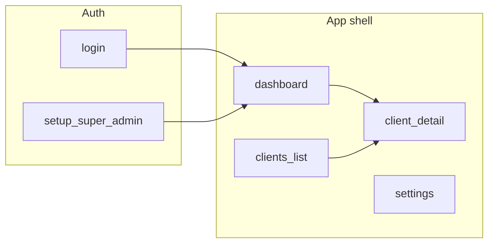

# Cerberus dashboard: pages, components, and function plan

## Ground truth from this repository

**Today the main HTTP app** ([`server/src/server.ts`](server/src/server.ts) / [`server/src/server.js`](server/src/server.js)) **only mounts**:

- [`/api/auth`](server/src/services/auth/routes/authRouter.js) — `POST /onboard-super-admin`, `POST /register` (super_admin only), `POST /login`, `GET /profile`, `GET /logout`
- [`/api/client`](server/src/services/client/routes/clientRoutes.js) — all routes require JWT cookie auth: `POST /admin/clients/onboard`, `POST /admin/clients/:clientId/users`, `POST/GET .../api/keys`

**Auth transport:** JWT is set as **httpOnly cookie** `authToken` on login/register/onboard ([`authController.js`](server/src/services/auth/controllers/authController.js)). The frontend must call the API with **`credentials: 'include'`** (Fetch) or **withCredentials** (Axios). For a separate origin (e.g. Vite on `:5173`, API on `:3000`), you need a **dev proxy** or shared parent domain; otherwise use a **BFF** in Next.js.

**Analytics code exists** ([`analyticsRoutes.js`](server/src/services/analytics/routes/analyticsRoutes.js), [`analyticsContoller.js`](server/src/services/analytics/controller/analyticsContoller.js), [`analyticsService.js`](server/src/services/analytics/services/analyticsService.js)) **but is not registered** on `app`—there is no `app.use('/api/analytics', ...)`. Your draft’s `GET /api/analytics/dashboard` and `GET /api/analytics/stats` match this module; **the server must mount it** (path suggestion: `/api/analytics`) before the UI can consume those URLs.

**Ingest** is implemented ([`ingestRoutes.js`](server/src/services/ingest/routes/ingestRoutes.js) → `POST /` with `x-api-key`) and documented as **`POST /api/hit`** in README, but **the main server does not mount ingest** either. The integration guide should use the **actual deployed base URL** once ingest is wired (same or separate service).

**Clients directory gap:** there is **no** `GET /api/client/admin/clients` (or similar) in [`clientRoutes.js`](server/src/services/client/routes/clientRoutes.js). A “Clients” table for super admins requires a **new backend endpoint** (or you accept onboarding-only UX: store last-created client id in UI state—not suitable for production).

**RBAC signals:** [`getProfile`](server/src/services/auth/services/authService.js) returns the user document (password stripped): `role`, `clientId`, `permissions` (for client-scoped users, see [`clientService.js`](server/src/services/client/services/clientService.js)). Super admin is `super_admin`; client roles include `client_admin` and `client_viewer` ([`roles.js`](server/src/shared/constants/roles.js)). **Hide/show nav** from `role` + `permissions` (e.g. `canManageUsers`, `canCreateApiKeys`, `canViewAnalytics`).

---

## Information architecture (pages)

| Route (suggested) | Who | Purpose |
|-------------------|-----|---------|
| `/login` | All | Form → `POST /api/auth/login`; redirect if cookie already valid (optional `GET /profile` probe). |
| `/setup` (or `/onboard`) | Unauthenticated, first deploy | Form → `POST /api/auth/onboard-super-admin`; handle 403 “onboarding disabled” when users already exist. |
| `/` | All | Redirect to `/dashboard` or `/login`. |
| `/dashboard` | Super admin + client users with analytics permission | Overview + charts; super admin can pass **`clientId` query** (see analytics controller). |
| `/clients` | **Super admin only** | Directory + “Onboard client” — **needs list API** from backend. |
| `/clients/[clientId]` | Super admin (any id); client admin/viewer (only own `clientId`) | Tabs: Overview (scoped metrics), Users (invite form), API keys, Integration. |
| `/users` | Optional global page | **Redundant** if `/clients/[id]` has user management; use one pattern to avoid duplicate forms. |
| `/api-keys` | **Optional** | Either alias to current client’s keys or remove in favor of client detail. |
| `/settings` | All | Profile display (`GET /api/auth/profile`), logout (`GET /api/auth/logout`), theme preference (local only unless you add API). |
| `/register` (internal) | Super admin | Form → `POST /api/auth/register` for creating users **without** `clientId` in route (note: current register flow creates users in Mongo; **client-bound users** should use `POST /api/client/admin/clients/:clientId/users`). |

**404 / guard:** Middleware or layout loader: if unauthenticated → `/login`; if client user hits another client’s `/clients/[id]` → 403 UI.

---

## Components (building blocks)

**App shell**

- `AppLayout`: sidebar + top bar + main content outlet.
- `SidebarNav`: links with RBAC predicates (Dashboard; Clients super-only; Settings).
- `UserMenu`: avatar/name from profile, Logout.
- `PageHeader`: title + optional client selector (super admin on dashboard: `clientId` query).
- `RequireAuth` / `RequireRole`: wrap segments or use route guards.

**Data / API**

- `apiClient`: base URL from env; credentials; JSON; central **401 → clear UI session → `/login`**.
- Query hooks (TanStack Query): `useProfile`, `useDashboard`, `useStats`, `useClientKeys`, mutations for login, onboard, onboard client, create user, create key.

**Dashboard**

- `MetricCard` × N: bind to analytics `stats` fields (below).
- `TimeRangePicker`: presets (24h / 7d / 30d) → maps to `startTime` / `endTime` query params (epoch ms or ISO strings accepted by [`validateTimeRange`](server/src/services/analytics/controller/analyticsContoller.js)).
- `TrafficTimeSeriesChart`: line or stacked bar from `recentActitivy` / time-series payload (**note typo** `recentActitivy` in API response—UI should tolerate or normalize).
- `TopEndpointsTable` or horizontal bar: from `topEndpoints`.
- `EmptyState` / `NoClientSelected`: super admin with no `clientId` sees **global** aggregates (`finalClientId === null` in controller).

**Clients & keys**

- `ClientsTable`: columns (name, slug, email, created…) — **blocked until list endpoint exists**; placeholder “Add client” only is honest MVP.
- `OnboardClientModal`: fields aligned to [`createClient`](server/src/services/client/services/clientService.js): `name`, `email`, `description`, `website`.
- `CreateClientUserForm`: `username`, `email`, `password`, `role` (`client_admin` | `client_viewer`).
- `ApiKeysTable`: masked key display (backend **strips `keyValue`** on list—show `keyId`, `name`, `environment`, dates).
- `RevealNewKeyModal`: **only after `POST .../api/keys`** response includes full key once—match actual [`createApiKey`](server/src/services/client/services/clientService.js) response shape (full `apiKey` with `keyValue`); warn “copy now, won’t show again” if that’s the contract.
- `IntegrationPanel`: static snippets (cURL, Node, Python) parameterized with **ingest URL** + `x-api-key` header and example JSON body matching [`ingestController`](server/src/services/ingest/controllers/ingestController.js) / README.

**UX polish (your Phase 5)**

- Toasts, skeletons for cards/charts/table, modal focus trap, copy-to-clipboard for new keys and snippets.

---

## Metrics and fields to show (from backend shapes)

From [`getOverallStats`](server/src/services/analytics/services/analyticsService.js) / dashboard bundle:

- **Cards:** `totalHits`, `avgLatency`, `errorRate`, `successHits` vs `errorHits` (or a single success/error stacked card), optional `uniqueServices`, `uniqueEndpoints`.
- **Subtitle:** `timeRange.start` / `timeRange.end` when returned.

From **dashboard** aggregate ([`getDashboard`](server/src/services/analytics/controller/analyticsContoller.js)):

- **`topEndpoints`** (limit 5): per row `serviceName`, `endpoint`, `method`, `totalHits`, `avgLatency`, `errorHits`, `errorRate` — **table** or **bar chart** (hits by endpoint label).
- **`recentActitivy` (time series):** per bucket `timeBucket`, `totalHits`, `errorHits`, `avgLatency`, optional `serviceName` / `endpoint` / `method` — **line chart** (hits over time) and optional second series for **latency**.

**Super-admin scoping:** `GET ...?clientId=<24hex>` for tenant-specific dashboard/stats; omit for global.

---

## Functional plan (what exists in the product)

1. **Session model:** Cookie-based session; profile is source of truth for RBAC after load.
2. **First-run:** Setup page calls onboard-super-admin; then login as normal.
3. **Login flow:** POST login → redirect to dashboard; errors from API surfaced inline + toast.
4. **Dashboard:** Load `GET /api/analytics/dashboard` (+ optional `GET /api/analytics/stats` if you want lighter refreshes); apply time range and (super) client filter; empty/error states.
5. **Super admin — clients:** Onboard client; open detail by id (from create response or future list); register flow only if you need non–client-scoped users (rare for this product).
6. **Client admin:** Default `clientId` from profile; dashboard without `clientId` query; manage keys and (if permitted) users under that client only.
7. **Integration hub:** Document ingest URL, headers (`x-api-key`), and example body; link to README [`README.md`](README.md) for canonical payload.
8. **Logout:** Call `GET /api/auth/logout` and clear any client-side caches (React Query).

---

## Recommended implementation order (mirrors your phases, tightened)

1. **Foundation:** Next.js (App Router) with API **rewrites/proxy** to backend origin for cookies **or** Vite + dev proxy; TanStack Query + one API wrapper; env `NEXT_PUBLIC_API_URL` / `VITE_API_URL`.
2. **Auth & shell:** Login, setup, protected layout, profile menu, RBAC nav.
3. **Dashboard:** Wire analytics **after** backend mounts `/api/analytics`; implement cards + time series + top endpoints.
4. **Client & keys:** Onboard + user create + keys list/create + integration copy blocks; **clients list** deferred or implemented **after** new `GET` clients API.
5. **Polish:** Dark theme, motion, toasts, skeletons.

---

## Summary checklist for you

- **Pages:** Login, Super-admin setup, Dashboard, Clients (super), Client detail, Settings; optional Register (super-only).
- **Components:** Layout, RBAC nav, metric cards, range picker, time-series chart, top-endpoints viz, tables/modals for clients/users/keys, integration snippets, auth guards.
- **Metrics/visualizations:** Total hits, avg latency, error rate, success vs errors, unique services/endpoints (optional), traffic over time, top routes (table or bar).
- **Backend prerequisites for a truthful UI:** mount analytics router; mount ingest (or document separate ingest base URL); add **list (and optionally get) clients** for super-admin directory.
