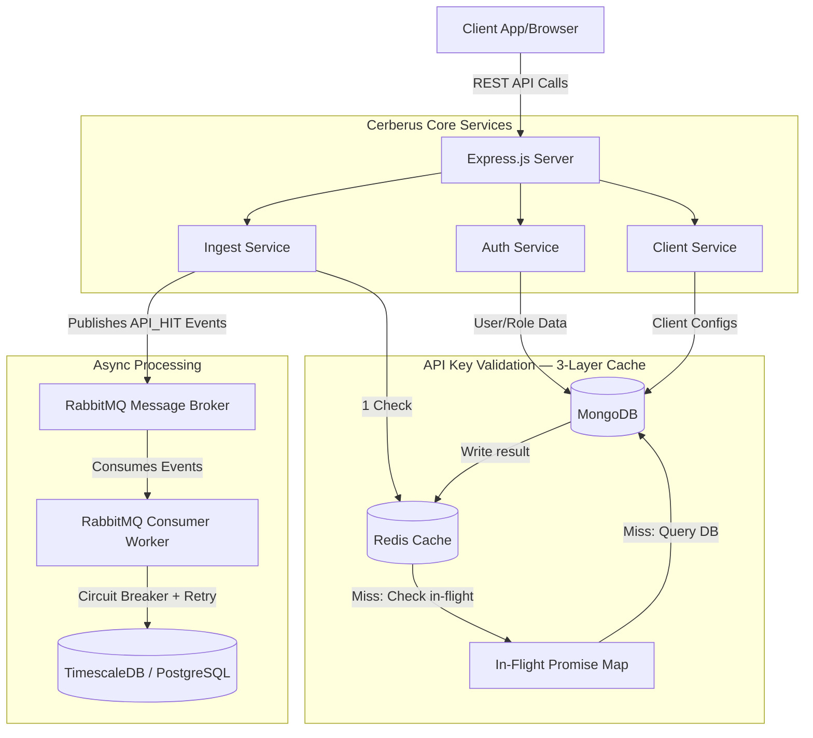
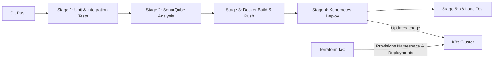

# Cerberus API Monitoring System

A highly scalable, real-time API Hit Tracking & Monitoring System built with a robust Node.js/Express microservices architecture. It leverages RabbitMQ for asynchronous message ingestion, MongoDB for flexible document storage, PostgreSQL/TimescaleDB for time-series analytics, and Redis for sub-millisecond API key validation caching.

---

## 🏗️ System Architecture

The application is structured into vertical service slices (Auth, Client, Ingest) ensuring domain-driven design.



### Components
1. **Express Server**: The main entry point, protected by rate limiting, Helmet security headers, and JWT-based authentication.
2. **Redis**: Distributed API key validation cache. Implements positive caching (5 min TTL), negative caching (60 s TTL for invalid keys), and in-process Promise deduplication to prevent cache stampedes.
3. **MongoDB**: Stores dynamic, document-based data such as Users, API Keys, and Client Profiles.
4. **RabbitMQ**: Acts as a high-throughput buffer. When API hits are recorded, they are instantly published to a queue rather than blocking the HTTP response.
5. **TimescaleDB (PostgreSQL)**: Stores heavily structured, aggregated metrics in a hypertable partitioned by month. Automatic compression (after 1 month) and data retention (1 year) are managed by TimescaleDB policies.

---

## 🔄 DevOps & CI/CD Pipeline

The repository includes a complete, production-ready DevOps pipeline using GitLab CI/CD, Terraform, Kubernetes, and SonarQube.



---

## ⚙️ Infrastructure Setup

> **⚠️ Important:** These steps must be performed **once** on a new environment before starting the application.

### Step 1 — Start all services via Docker Compose

```bash
cd server
docker compose up -d
```

This starts PostgreSQL (TimescaleDB), MongoDB, RabbitMQ, and Redis. Wait for all containers to report healthy:

```bash
docker compose ps
```

### Step 2 — Run the TimescaleDB migration

> **Why `docker exec`?** The PostgreSQL instance runs inside Docker. Using `docker exec` connects directly to the container, bypassing host-level `pg_hba.conf` ident authentication — no password prompt needed.

```bash
# Copy the migration script into the running container
docker cp server/scripts/migrate-timescale.sql api-monitoring-postgres:/tmp/migrate-timescale.sql

# Execute the migration inside the container
docker exec -it api-monitoring-postgres \
  psql -U postgres -d api_monitoring -f /tmp/migrate-timescale.sql
```

**Verify the migration succeeded:**
```bash
docker exec -it api-monitoring-postgres \
  psql -U postgres -d api_monitoring \
  -c "SELECT hypertable_name, num_chunks FROM timescaledb_information.hypertables;"
```

You should see `endpoint_metrics` listed. The chunk count starts at 0 and increases as data is written.

> **Connecting from the host with a password** (alternative):
> ```bash
> PGPASSWORD=your_secure_password psql \
>   -h localhost -U postgres -d api_monitoring \
>   -f server/scripts/migrate-timescale.sql
> ```

### Step 3 — Verify Redis is running

```bash
docker exec -it api-monitoring-redis redis-cli ping
# Expected: PONG
```

---

## 🚀 Running the CI/CD Pipeline

The GitLab CI/CD pipeline is fully defined in `.gitlab-ci.yml` and triggers automatically on commits to the `main` branch.

### 1. Prerequisites (GitLab Variables)
Before running the pipeline, configure these in **Settings > CI/CD > Variables**:

*   `SONAR_TOKEN`: Authentication token for SonarQube/SonarCloud.
*   `SONAR_HOST_URL`: The URL to your Sonar instance (e.g., `https://sonarcloud.io`).
*   `CI_REGISTRY`, `CI_REGISTRY_USER`, `CI_REGISTRY_PASSWORD`: Your Docker registry credentials.
*   `KUBECONFIG_CONTENT`: Your base64-encoded `~/.kube/config` file to allow GitLab to authenticate with your Kubernetes cluster.

### 2. Infrastructure provisioning (Terraform)
If you are deploying to a brand new cluster, provision the baseline architecture first:
```bash
cd terraform
terraform init
terraform apply -var="image_name=registry.gitlab.com/your-org/cerberus-api:latest"
```

### 3. Pipeline Stages
Once variables are set, pushing to `main` triggers:
1. **Test (`npm test`)**: Executes Jest unit tests and Supertest integration tests. A live Redis sidecar is spun up automatically by the CI runner. Failing tests block the pipeline.
2. **Sonar**: Scans code for vulnerabilities, bugs, and test coverage using `sonar-project.properties`.
3. **Build**: Builds the Dockerfile, tags it with the Git SHA, and pushes to your secure registry.
4. **Deploy**: Decodes your Kubeconfig, applies `k8s/redis.yaml` then `k8s/deployment.yaml`, and waits for the rollout to complete via `kubectl rollout status`.
5. **Load Test**: Runs the `k6` load test (`server/tests/load/k6-load-test.js`) against the newly deployed pods to verify performance thresholds.

---

## 💻 Local Development

1. **Install Dependencies:**
   ```bash
   cd server
   npm install
   ```

2. **Environment Variables:**
   Copy `.env.example` to `.env` and fill in your values:
   ```bash
   cp .env.example .env
   ```
   Key variables:
   - `POSTGRES_PASSWORD` — used by Docker Compose for TimescaleDB
   - `JWT_SECRET` — minimum 32 characters
   - `REDIS_URL` — defaults to `redis://localhost:6379` (no change needed for Docker)
   - `RABBITMQ_DEFAULT_USER` / `RABBITMQ_DEFAULT_PASS`

3. **Start infrastructure:**
   ```bash
   cd server
   docker compose up -d
   ```

4. **Run the TimescaleDB migration** *(first time only)*
   See [Infrastructure Setup](#️-infrastructure-setup) above.

5. **Run the Application:**
   ```bash
   # Start the Express API
   npm run dev

   # Start the RabbitMQ Consumer (in a separate terminal)
   npm run processor
   ```

6. **Run Tests Locally:**
   ```bash
   npm test
   ```

---

## 🧪 Testing

The repository uses Jest and Supertest for unit and integration testing. The test suite covers contracts, authentication, message queues, eventual consistency, resilience, and idempotency.

**Run All Tests at Once:**
```bash
cd server
npm test
```

**Run Individual Test Suites:**
```bash
# 1. API / Contract Tests
npm test -- tests/integration/contract.test.ts

# 2. Authentication & Authorization Tests
npm test -- tests/integration/auth.middleware.test.ts
npm test -- tests/integration/auth.test.ts

# 3. Message Queue Tests (RabbitMQ)
npm test -- tests/unit/rabbitmq.test.ts

# 4. Data Consistency Tests (MongoDB + PostgreSQL)
npm test -- tests/integration/consistency.test.ts

# 5. Failure / Resilience Tests
npm test -- tests/unit/resilience.test.ts

# 6. Idempotency Tests
npm test -- tests/unit/idempotency.test.ts
```

---

## 🔧 Useful Operational Commands

```bash
# Check all container health statuses
docker compose ps

# Tail application logs
docker compose logs -f api-app

# Tail consumer/worker logs
docker compose logs -f consumer

# Inspect TimescaleDB monthly partitions
docker exec -it api-monitoring-postgres \
  psql -U postgres -d api_monitoring \
  -c "SELECT chunk_name, range_start, range_end, is_compressed \
      FROM timescaledb_information.chunks \
      WHERE hypertable_name = 'endpoint_metrics' \
      ORDER BY range_start;"

# Flush the entire Redis cache (e.g. after a bulk API key rotation)
docker exec -it api-monitoring-redis redis-cli FLUSHDB

# Check Redis memory usage
docker exec -it api-monitoring-redis redis-cli INFO memory | grep used_memory_human

# Gracefully restart only the API pod (K8s rolling update)
kubectl rollout restart deployment/cerberus-api -n cerberus
```
