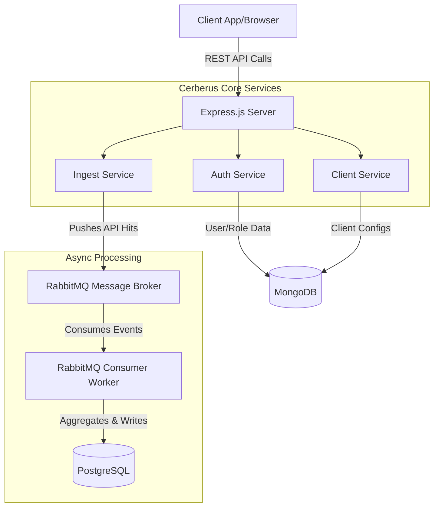
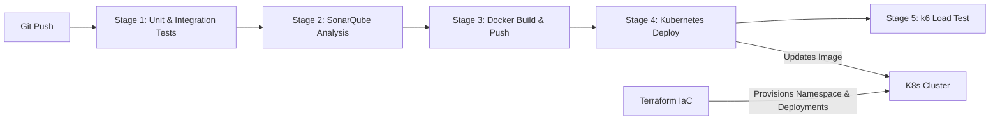

# Cerberus API Monitoring System

A highly scalable, real-time API Hit Tracking & Monitoring System built with a robust Node.js/Express microservices architecture. It leverages RabbitMQ for asynchronous message ingestion, MongoDB for flexible document storage, and PostgreSQL for structured data reporting.

---

## 🏗️ System Architecture

The application is structured into vertical service slices (Auth, Client, Ingest) ensuring domain-driven design. 



### Components
1. **Express Server**: The main entry point, protected by rate limiting, Helmet security headers, and JWT-based authentication.
2. **MongoDB**: Stores dynamic, document-based data such as Users, API Keys, and Client Profiles.
3. **RabbitMQ**: Acts as a high-throughput buffer. When API hits are recorded, they are instantly published to a queue rather than blocking the HTTP response.
4. **PostgreSQL**: Stores the heavily structured, aggregated metrics data required for complex analytical queries.

---

## 🔄 DevOps & CI/CD Pipeline

The repository includes a complete, production-ready DevOps pipeline using GitLab CI/CD, Terraform, Kubernetes, and SonarQube.



---

## 🚀 Running the Pipeline

The GitLab CI/CD pipeline is fully defined in `.gitlab-ci.yml` and triggers automatically on commits to the `main` branch.

### 1. Prerequisites (GitLab Variables)
Before running the pipeline, ensure the following variables are configured in your GitLab repository (**Settings > CI/CD > Variables**):

*   `SONAR_TOKEN`: Authentication token for SonarQube/SonarCloud.
*   `SONAR_HOST_URL`: The URL to your Sonar instance (e.g., `https://sonarcloud.io`).
*   `CI_REGISTRY`, `CI_REGISTRY_USER`, `CI_REGISTRY_PASSWORD`: Your Docker registry credentials.
*   `KUBECONFIG_CONTENT`: Your base64-encoded `~/.kube/config` file to allow GitLab to authenticate with your Kubernetes cluster.

### 2. Infrastructure provisioning (Terraform)
If you are deploying to a brand new cluster, provision the baseline architecture first:
```bash
cd terraform
terraform init
terraform apply -var="image_name=registry.gitlab.com/your-org/cerberus-api:latest"
```

### 3. Pipeline Stages
Once variables are set, pushing to `main` triggers:
1. **Test (`npm test`)**: Executes Jest unit tests and Supertest integration tests with mocked DB instances. Failing tests stop the pipeline.
2. **Sonar**: Scans code for vulnerabilities, bugs, and test coverage using `sonar-project.properties`.
3. **Build**: Builds the Dockerfile, tags it with the Git SHA, and pushes to your secure registry.
4. **Deploy**: Decodes your Kubeconfig, uses `sed` to inject the new Docker tag into `k8s/deployment.yaml`, and applies the manifests via `kubectl`.
5. **Load Test**: Runs the `k6` load test (`server/tests/load/k6-load-test.js`) against the newly deployed pods to verify performance thresholds.

---

## 💻 Local Development

1. **Install Dependencies:**
   ```bash
   cd server
   npm install
   ```

2. **Environment Variables:**
   Copy `.env.example` to `.env` and configure your database and RabbitMQ URLs.

3. **Run the Application:**
   ```bash
   # Start the Express API
   npm run dev
   
   # Start the RabbitMQ Consumer (in a separate terminal)
   npm run processor
   ```

4. **Run Tests Locally:**
   ```bash
   npm test
   ```

---

## 🧪 Testing

The repository uses Jest and Supertest for unit and integration testing. The test suite covers contracts, authentication, message queues, eventual consistency, resilience, and idempotency.

**Run All Tests at Once:**
```bash
cd server
npm test
```

**Run Individual Test Suites:**
If you want to run specific testing scenarios independently, you can pass the file path to the test script:

```bash
# 1. API / Contract Tests
npm test -- tests/integration/contract.test.ts

# 2. Authentication & Authorization Tests
npm test -- tests/integration/auth.middleware.test.ts
npm test -- tests/integration/auth.test.ts

# 3. Message Queue Tests (RabbitMQ)
npm test -- tests/unit/rabbitmq.test.ts

# 4. Data Consistency Tests (MongoDB + PostgreSQL)
npm test -- tests/integration/consistency.test.ts

# 5. Failure / Resilience Tests
npm test -- tests/unit/resilience.test.ts

# 6. Idempotency Tests
npm test -- tests/unit/idempotency.test.ts
```
