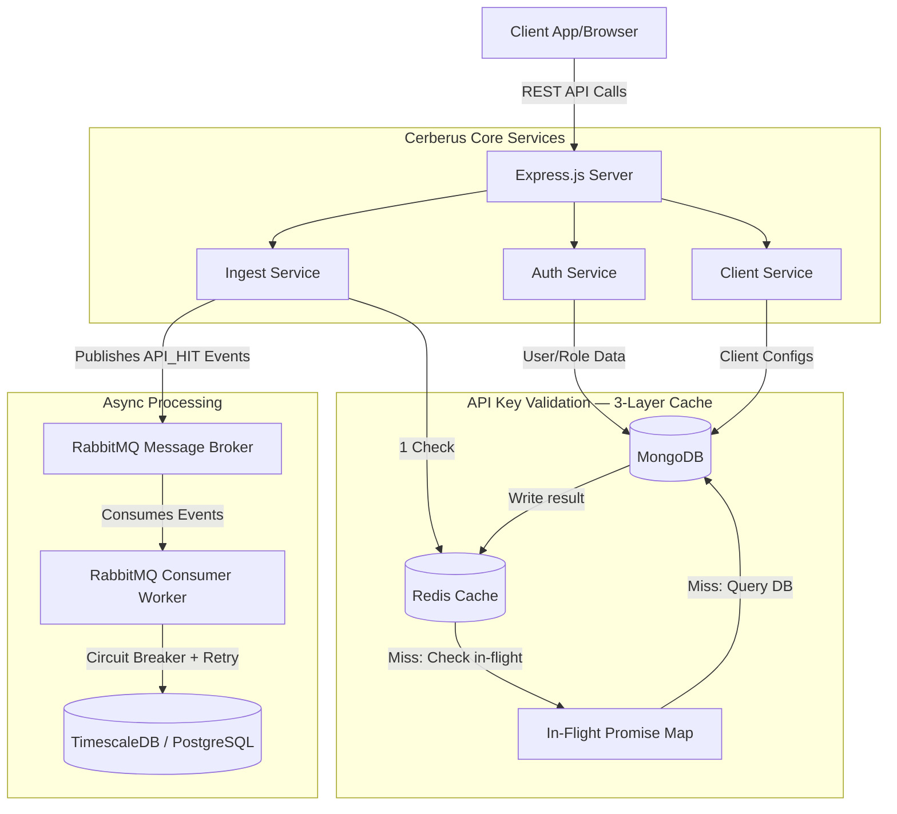
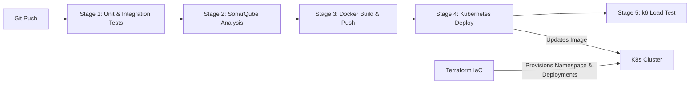

# Cerberus API Monitoring System

A highly scalable, real-time API Hit Tracking & Monitoring System built with a robust Node.js/Express microservices architecture. It leverages RabbitMQ for asynchronous message ingestion, MongoDB for flexible document storage, PostgreSQL/TimescaleDB for time-series analytics, and Redis for sub-millisecond API key validation caching.

---

## 🏗️ System Architecture

The application is structured into vertical service slices (Auth, Client, Ingest) ensuring domain-driven design.



### Components
1. **Express Server**: The main entry point, protected by rate limiting, Helmet security headers, and JWT-based authentication.
2. **Redis**: Distributed API key validation cache. Implements positive caching (5 min TTL), negative caching (60 s TTL for invalid keys), and in-process Promise deduplication to prevent cache stampedes.
3. **MongoDB**: Stores dynamic, document-based data such as Users, API Keys, and Client Profiles.
4. **RabbitMQ**: Acts as a high-throughput buffer. When API hits are recorded, they are instantly published to a queue rather than blocking the HTTP response.
5. **TimescaleDB (PostgreSQL)**: Stores heavily structured, aggregated metrics in a hypertable partitioned by month. Automatic compression (after 1 month) and data retention (1 year) are managed by TimescaleDB policies.

---

## 🔄 DevOps & CI/CD Pipeline

The repository includes a complete, production-ready DevOps pipeline using GitLab CI/CD, Terraform, Kubernetes, and SonarQube.



---

## ⚙️ Infrastructure Setup

> **⚠️ Important:** These steps must be performed **once** on a new environment before starting the application.

### Step 1 — Start all services via Docker Compose

```bash
cd server
docker compose up -d
```

This starts PostgreSQL (TimescaleDB), MongoDB, RabbitMQ, and Redis. Wait for all containers to report healthy:

```bash
docker compose ps
```

### Step 2 — Run the TimescaleDB migration

> **Why `docker exec`?** The PostgreSQL instance runs inside Docker. Using `docker exec` connects directly to the container, bypassing host-level `pg_hba.conf` ident authentication — no password prompt needed.

```bash
# Copy the migration script into the running container
docker cp server/scripts/migrate-timescale.sql api-monitoring-postgres:/tmp/migrate-timescale.sql

# Execute the migration inside the container
docker exec -it api-monitoring-postgres \
  psql -U postgres -d api_monitoring -f /tmp/migrate-timescale.sql
```

**Verify the migration succeeded:**
```bash
docker exec -it api-monitoring-postgres \
  psql -U postgres -d api_monitoring \
  -c "SELECT hypertable_name, num_chunks FROM timescaledb_information.hypertables;"
```

You should see `endpoint_metrics` listed. The chunk count starts at 0 and increases as data is written.

> **Connecting from the host with a password** (alternative):
> ```bash
> PGPASSWORD=your_secure_password psql \
>   -h localhost -U postgres -d api_monitoring \
>   -f server/scripts/migrate-timescale.sql
> ```

### Step 3 — Verify Redis is running

```bash
docker exec -it api-monitoring-redis redis-cli ping
# Expected: PONG
```

---

## 🚀 Running the CI/CD Pipeline

The GitLab CI/CD pipeline is fully defined in `.gitlab-ci.yml` and triggers automatically on commits to the `main` branch.

### 1. Prerequisites (GitLab Variables)
Before running the pipeline, configure these in **Settings > CI/CD > Variables**:

*   `SONAR_TOKEN`: Authentication token for SonarQube/SonarCloud.
*   `SONAR_HOST_URL`: The URL to your Sonar instance (e.g., `https://sonarcloud.io`).
*   `CI_REGISTRY`, `CI_REGISTRY_USER`, `CI_REGISTRY_PASSWORD`: Your Docker registry credentials.
*   `KUBECONFIG_CONTENT`: Your base64-encoded `~/.kube/config` file to allow GitLab to authenticate with your Kubernetes cluster.

### 2. Infrastructure provisioning (Terraform)
If you are deploying to a brand new cluster, provision the baseline architecture first:
```bash
cd terraform
terraform init
terraform apply -var="image_name=registry.gitlab.com/your-org/cerberus-api:latest"
```

### 3. Pipeline Stages
Once variables are set, pushing to `main` triggers:
1. **Test (`npm test`)**: Executes Jest unit tests and Supertest integration tests. A live Redis sidecar is spun up automatically by the CI runner. Failing tests block the pipeline.
2. **Sonar**: Scans code for vulnerabilities, bugs, and test coverage using `sonar-project.properties`.
3. **Build**: Builds the Dockerfile, tags it with the Git SHA, and pushes to your secure registry.
4. **Deploy**: Decodes your Kubeconfig, applies `k8s/redis.yaml` then `k8s/deployment.yaml`, and waits for the rollout to complete via `kubectl rollout status`.
5. **Load Test**: Runs the `k6` load test (`server/tests/load/k6-load-test.js`) against the newly deployed pods to verify performance thresholds.

---

## 💻 Local Development

1. **Install Dependencies:**
   ```bash
   cd server
   npm install
   ```

2. **Environment Variables:**
   Copy `.env.example` to `.env` and fill in your values:
   ```bash
   cp .env.example .env
   ```
   Key variables:
   - `POSTGRES_PASSWORD` — used by Docker Compose for TimescaleDB
   - `JWT_SECRET` — minimum 32 characters
   - `REDIS_URL` — defaults to `redis://localhost:6379` (no change needed for Docker)
   - `RABBITMQ_DEFAULT_USER` / `RABBITMQ_DEFAULT_PASS`

3. **Start infrastructure:**
   ```bash
   cd server
   docker compose up -d
   ```

4. **Run the TimescaleDB migration** *(first time only)*
   See [Infrastructure Setup](#️-infrastructure-setup) above.

5. **Run the Application:**
   ```bash
   # Start the Express API
   npm run dev

   # Start the RabbitMQ Consumer (in a separate terminal)
   npm run processor
   ```

6. **Run Tests Locally:**
   ```bash
   npm test
   ```

---

## 🧪 Testing

The repository uses Jest and Supertest for unit and integration testing. The test suite covers contracts, authentication, message queues, eventual consistency, resilience, and idempotency.

**Run All Tests at Once:**
```bash
cd server
npm test
```

**Run Individual Test Suites:**
```bash
# 1. API / Contract Tests
npm test -- tests/integration/contract.test.ts

# 2. Authentication & Authorization Tests
npm test -- tests/integration/auth.middleware.test.ts
npm test -- tests/integration/auth.test.ts

# 3. Message Queue Tests (RabbitMQ)
npm test -- tests/unit/rabbitmq.test.ts

# 4. Data Consistency Tests (MongoDB + PostgreSQL)
npm test -- tests/integration/consistency.test.ts

# 5. Failure / Resilience Tests
npm test -- tests/unit/resilience.test.ts

# 6. Idempotency Tests
npm test -- tests/unit/idempotency.test.ts
```

---

## 🔧 Useful Operational Commands

```bash
# Check all container health statuses
docker compose ps

# Tail application logs
docker compose logs -f api-app

# Tail consumer/worker logs
docker compose logs -f consumer

# Inspect TimescaleDB monthly partitions
docker exec -it api-monitoring-postgres \
  psql -U postgres -d api_monitoring \
  -c "SELECT chunk_name, range_start, range_end, is_compressed \
      FROM timescaledb_information.chunks \
      WHERE hypertable_name = 'endpoint_metrics' \
      ORDER BY range_start;"

# Flush the entire Redis cache (e.g. after a bulk API key rotation)
docker exec -it api-monitoring-redis redis-cli FLUSHDB

# Check Redis memory usage
docker exec -it api-monitoring-redis redis-cli INFO memory | grep used_memory_human

# Gracefully restart only the API pod (K8s rolling update)
kubectl rollout restart deployment/cerberus-api -n cerberus
```

---

## 📡 Client Integration Guide

Cerberus uses an **async fire-and-forget** pattern. Your application wraps its own request lifecycle in a middleware, then fires a non-blocking POST to Cerberus **after** the response is sent — Cerberus never adds latency to your users.

### The API Contract

**Endpoint:** `POST /api/hit`  
**Header:** `x-api-key: <your_cerberus_api_key>`

```json
{
  "endpoint":      "/users/profile",
  "method":        "GET",
  "statusCode":    200,
  "latencyMs":     45,
  "serviceName":   "user-service",
  "requestBytes":  320,
  "responseBytes": 1840
}
```

| Field | Type | Required | Description |
|---|---|---|---|
| `endpoint` | string | ✅ | The matched route path (e.g. `/api/orders/:id`) |
| `method` | string | ✅ | HTTP verb: `GET`, `POST`, `PUT`, etc. |
| `statusCode` | integer | ✅ | HTTP status code returned to your client |
| `latencyMs` | integer | ✅ | Total response time in milliseconds |
| `serviceName` | string | ✅ | Logical name of your service (e.g. `checkout-api`) |
| `requestBytes` | integer | ⬜ | Size of incoming request body in bytes |
| `responseBytes` | integer | ⬜ | Size of outgoing response body in bytes |

**Success:** `202 Accepted` — the hit is queued; you do not need to wait for this response.  
**On `429`:** Back off using the `Retry-After` header returned by Cerberus.

---

### Step 1 — Get Your API Key

```bash
curl -X POST https://your-cerberus-host/api/client/<clientId>/keys \
  -H "Authorization: Bearer <admin_jwt>" \
  -H "Content-Type: application/json" \
  -d '{ "name": "production-key", "environment": "production" }'
```

Store the returned `keyValue` as `CERBERUS_API_KEY` in your environment — **it is shown only once**.

---

### Step 2 — Add the Middleware to Your Application

The pattern is identical across all languages:
1. Record `start = now()` **before** your handler runs.
2. Run your normal handler.
3. **After** the response is sent, fire a non-blocking POST to Cerberus.

#### Node.js / Express

```javascript
const CERBERUS_URL = process.env.CERBERUS_URL;
const CERBERUS_KEY = process.env.CERBERUS_API_KEY;

function cerberusMiddleware(req, res, next) {
  const start = Date.now();

  // 'finish' fires after the response bytes are fully flushed to the client
  res.on('finish', () => {
    const payload = {
      endpoint:      req.route?.path ?? req.path,
      method:        req.method,
      statusCode:    res.statusCode,
      latencyMs:     Date.now() - start,
      serviceName:   'my-service',
      requestBytes:  Number(req.headers['content-length'] ?? 0),
      responseBytes: Number(res.getHeader('content-length') ?? 0),
    };

    // Fire-and-forget — no await, never blocks the response
    fetch(CERBERUS_URL, {
      method:  'POST',
      headers: { 'Content-Type': 'application/json', 'x-api-key': CERBERUS_KEY },
      body:    JSON.stringify(payload),
    }).catch(() => {});  // Silently discard — Cerberus failure must never crash your app
  });

  next();
}

app.use(cerberusMiddleware);
```

#### Python / FastAPI

```python
import time, os, asyncio
import httpx
from fastapi import Request

CERBERUS_URL = os.getenv("CERBERUS_URL")
CERBERUS_KEY = os.getenv("CERBERUS_API_KEY")

async def cerberus_middleware(request: Request, call_next):
    start = time.monotonic()
    response = await call_next(request)
    latency_ms = int((time.monotonic() - start) * 1000)

    payload = {
        "endpoint":      str(request.url.path),
        "method":        request.method,
        "statusCode":    response.status_code,
        "latencyMs":     latency_ms,
        "serviceName":   "my-service",
        "requestBytes":  int(request.headers.get("content-length", 0)),
        "responseBytes": int(response.headers.get("content-length", 0)),
    }

    asyncio.create_task(_send(payload))  # Non-blocking background coroutine
    return response

async def _send(payload: dict):
    try:
        async with httpx.AsyncClient(timeout=3.0) as client:
            await client.post(CERBERUS_URL, json=payload,
                              headers={"x-api-key": CERBERUS_KEY})
    except Exception:
        pass  # Cerberus is non-critical — never surface this error

app.middleware("http")(cerberus_middleware)
```

#### Go / net/http

```go
type responseWriter struct {
    http.ResponseWriter
    statusCode int
}
func (rw *responseWriter) WriteHeader(code int) {
    rw.statusCode = code
    rw.ResponseWriter.WriteHeader(code)
}

func CerberusMiddleware(next http.Handler) http.Handler {
    return http.HandlerFunc(func(w http.ResponseWriter, r *http.Request) {
        start := time.Now()
        rw := &responseWriter{w, http.StatusOK}
        next.ServeHTTP(rw, r)

        go func() {  // goroutine = fire-and-forget
            body, _ := json.Marshal(map[string]any{
                "endpoint":    r.URL.Path,
                "method":      r.Method,
                "statusCode":  rw.statusCode,
                "latencyMs":   time.Since(start).Milliseconds(),
                "serviceName": "my-service",
            })
            req, _ := http.NewRequest("POST", os.Getenv("CERBERUS_URL"), bytes.NewBuffer(body))
            req.Header.Set("Content-Type", "application/json")
            req.Header.Set("x-api-key", os.Getenv("CERBERUS_API_KEY"))
            (&http.Client{Timeout: 3 * time.Second}).Do(req)
        }()
    })
}
```

#### PHP (PSR-15 Middleware)

```php
class CerberusMiddleware implements MiddlewareInterface {
    public function process(Request $request, Handler $handler): Response {
        $start = microtime(true);
        $response = $handler->handle($request);

        // register_shutdown_function runs after the response is sent to the browser
        register_shutdown_function(function() use ($request, $response, $start) {
            $payload = json_encode([
                'endpoint'    => $request->getUri()->getPath(),
                'method'      => $request->getMethod(),
                'statusCode'  => $response->getStatusCode(),
                'latencyMs'   => (int)((microtime(true) - $start) * 1000),
                'serviceName' => 'my-service',
            ]);
            $ctx = stream_context_create(['http' => [
                'method'  => 'POST',
                'header'  => "Content-Type: application/json\r\nx-api-key: " . getenv('CERBERUS_API_KEY'),
                'content' => $payload,
                'timeout' => 3,
            ]]);
            @file_get_contents(getenv('CERBERUS_URL'), false, $ctx);
        });

        return $response;
    }
}
```

---

### Step 3 — Set Environment Variables

```dotenv
CERBERUS_URL=https://your-cerberus-host/api/hit
CERBERUS_API_KEY=apim_<your_key_from_step_1>
```

---

### ⚠️ Tradeoffs to Know

| Concern | Risk | Mitigation |
|---|---|---|
| **Cerberus goes down** | Background POSTs fail silently | Always wrap in try/catch and discard the error |
| **Traffic spike (>1k RPS)** | Thread/goroutine explosion | Switch to in-memory batching — buffer hits, flush every 5s |
| **Socket exhaustion** | Many concurrent background connections | Reuse a shared HTTP client with a connection pool (shown in examples) |
| **Streamed response bodies** | `content-length` header absent | Default to `0`; `requestBytes`/`responseBytes` are optional |
| **Cerberus responds slowly** | Background thread held open | Hard 3s timeout on all Cerberus calls (shown in examples) |
